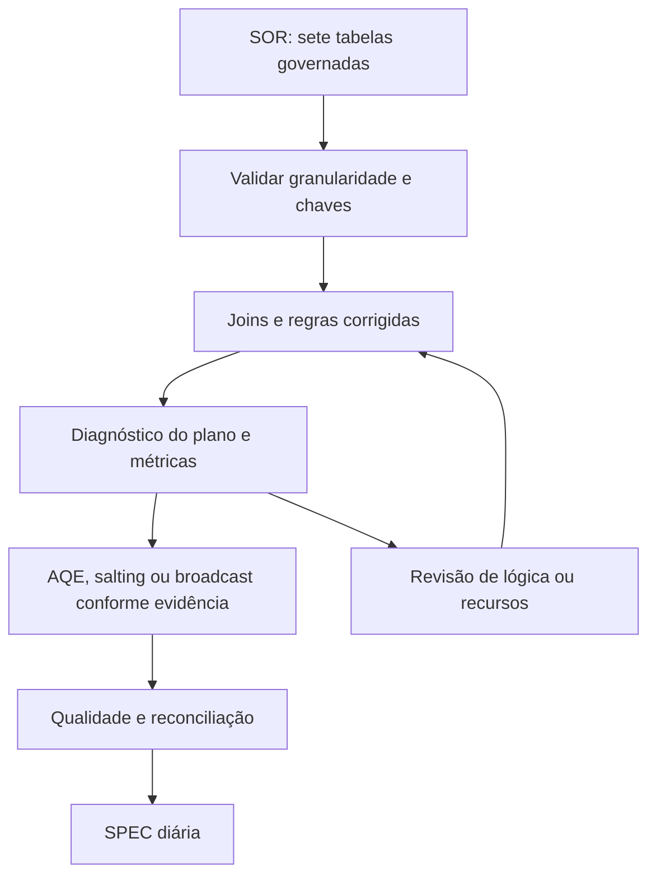

# Spark Skew Performance Lab
**Diagnóstico, cardinalidade e otimização de processamento distribuído.**

Reconstrução de um caso com sete tabelas de vulnerabilidades/governança e uma origem de findings próxima de **500 milhões de registros**, em **AWS Glue 4.0**. O produto final profissional era uma tabela especializada diária (SPEC), derivada de origens SOR, no contexto de dados usados em acompanhamento de PCI DSS e reportes regulatórios.

PCI DSS é um padrão de segurança de dados de cartões. Um pipeline de dados relacionado a PCI não certifica conformidade; o reporte ao BACEN é um contexto de consumo relatado e não uma equivalência entre os dois requisitos.

## Minha atuação
Participei do desenho e realizei a implantação, o acompanhamento da entrega, o handover e os testes das tabelas finais. No caso relatado, a lógica de negócio foi revista antes da otimização de execução.

## O problema que importa
Foi relatado um intermediário da ordem de **1 trilhão de linhas** na lógica inicial. Isso representa uma **explosão de cardinalidade**; skew é a distribuição desigual do trabalho. Os dois problemas podem coexistir. Sem o plano e as chaves originais, um join many-to-many indevido é uma hipótese explicativa, não uma causa comprovada.

A demo reproduz esse risco em tamanho pequeno, exige dimensão única para um join many-to-one e compara baseline, AQE, salting seletivo e broadcast.

## Executar
Use Python 3.10 e Java 11 para o laboratório local. Spark é fixado em 3.3.0, versão base do Glue 4.0; o runtime local não reproduz todas as modificações AWS.
```bash
python -m pip install -r requirements.txt
python -m unittest discover -s tests -v
python -m src.demo --mode baseline --rows 50000
python -m src.demo --mode aqe --rows 50000
python -m src.demo --mode salt --rows 50000
python -m src.demo --mode broadcast --rows 50000
python -m src.capacity
```

Cada comando imprime duração local, agregados e plano físico. A validação de equivalência compara os resultados completos em um fixture pequeno. A demo NÃO executa 500 milhões de linhas nem grava SPEC/S3.

## Arquitetura de referência


## A estimativa de 2–3 horas faz sentido?
**É plausível, mas não é validada apenas pelo número de registros.** Assumindo 30 workers G.2X constantes, são 60 DPUs e 120–180 DPU-h por execução. Para 500 milhões de registros, a vazão equivalente de entrada seria aproximadamente 46–69 mil registros/s. O período e o tamanho do cluster são estimativas do autor, ainda sem logs comprobatórios.

O volume em bytes, o número de leituras e shuffles, a expansão dos joins, o skew remanescente e a escrita determinam a duração. Consulte [a análise de capacidade](docs/capacity.md).

## O que este repositório demonstra
- Dados sintéticos com concentração configurável em uma chave.
- Validação de cardinalidade antes do join.
- Salting determinístico na tabela grande e expansão correspondente na dimensão para a chave concentrada.
- AQE e broadcast como alternativas mensuráveis.
- Testes que preservam multiplicidade e valores do resultado.
- Estimativa aritmética de capacidade, sem publicar ganhos inventados.

## Documentação
[Arquitetura](docs/architecture.md) · [Decisões](docs/decisions/001-correctness-before-tuning.md) · [Benchmark](docs/benchmark.md) · [Handover](docs/runbook.md) · [Autoria](docs/provenance.md)

## Portfólio
[Ingestão](https://github.com/kevinpabe/mainframe-to-data-lake) · [Alertas](https://github.com/kevinpabe/operational-intelligence-alerts) · [Semântica](https://github.com/kevinpabe/semantic-context-for-agents)

## Fontes primárias
- [Versões do Glue](https://docs.aws.amazon.com/glue/latest/dg/release-notes.html)
- [Workers e capacidade](https://docs.aws.amazon.com/glue/latest/dg/add-job.html)
- [Spark: SQL performance tuning](https://spark.apache.org/docs/3.5.6/sql-performance-tuning.html) — referência explicativa; validar recursos no runtime 3.3.0.
- [Spark: configurações](https://spark.apache.org/docs/3.5.6/configuration.html)
